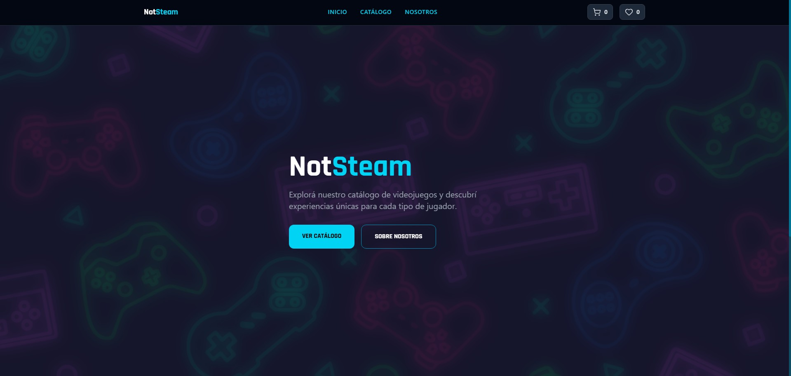

# NotSteam



## Descripción
NotSteam es un proyecto de ecommerce destinado a la venta digital de videojuegos, desarrollado en React y estilizado enteramente con Tailwind.
Primer parcial de la materia Construcción de Interfaces de Usuario de la Universidad Nacional de Hurlingham.

## Tecnologías Utilizadas
- JavaScript
- React
- Vite
- Tailwind
- React Router DOM
- Lucide React

## Instrucciones para instalar y correr el proyecto
1. Clonar el repositorio:
   ```bash
   git clone <url_del_repositorio>
   cd notsteam
   ```
2. Instalar dependencias:
   ```bash
   npm install
   ```
3. Iniciar el servidor de desarrollo:
   ```bash
   npm run dev
   ```
4. Abrir el navegador en la URL que muestre Vite, que normalmente es: `http://localhost:5173`.

## Link al deploy
- Se realizo el deploy publico en Vercel.
- https://notsteamstore.vercel.app/

## Funcionalidades
- Header y footer, páginas de inicio, catálogo de productos, detalles de producto en específico y página sobre nosotros.
- Múltiples filtros para la búsqueda de productos; por nombre, categoría, y precio.
- Formulario para realizar la compra y módulo de pago simulado.
- Sistemas de carrito y de favoritos, con sus funciones de agregar, eliminar y vaciar.

## Autores
- Luca Carlino
- Agustin Leandro Oviedo
- Rodrigo Alarcon
- David Acosta